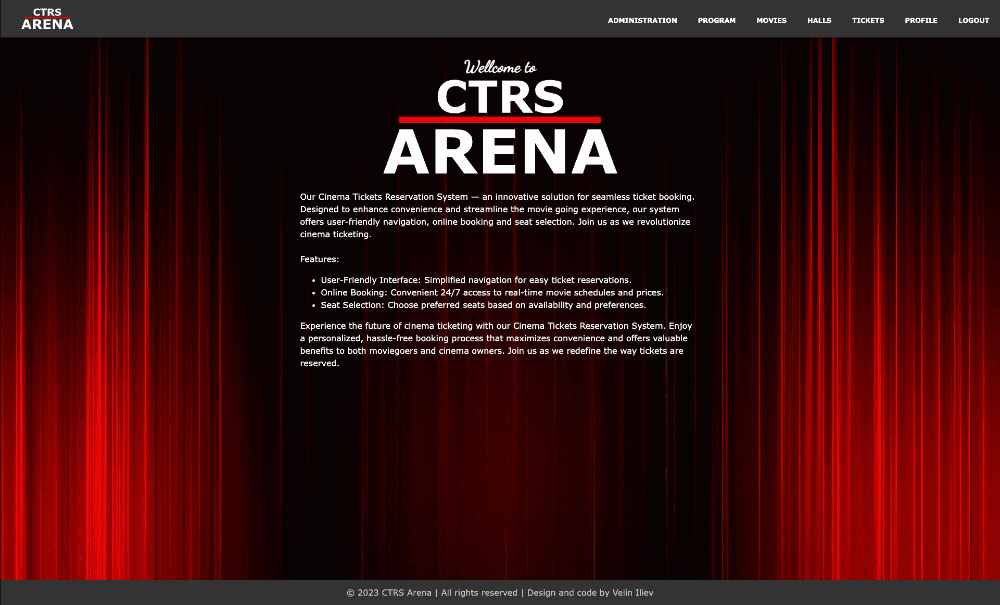
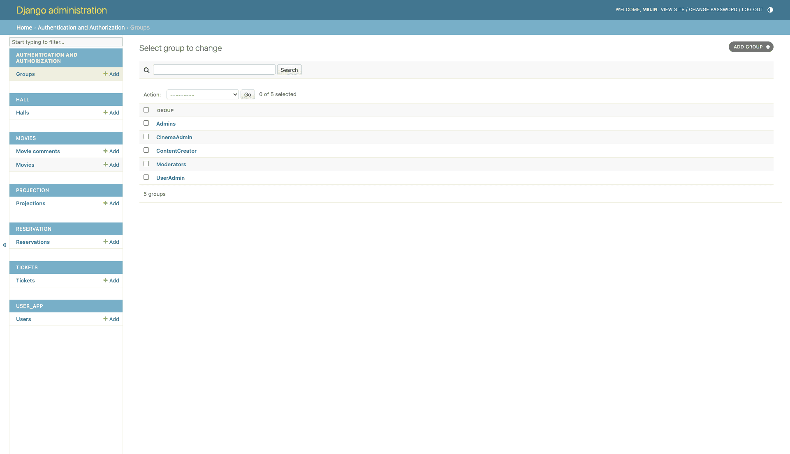
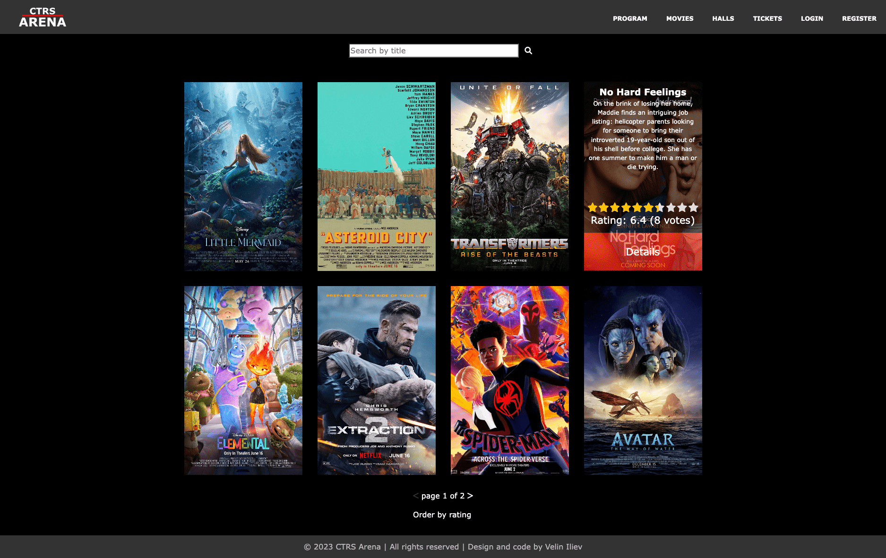
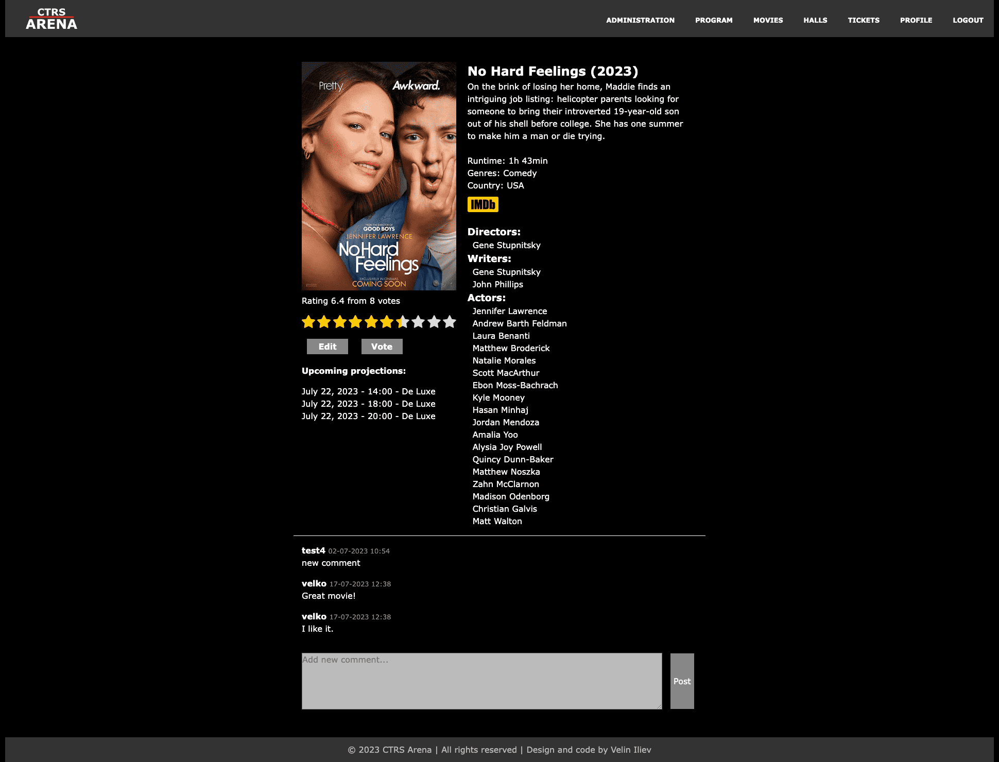
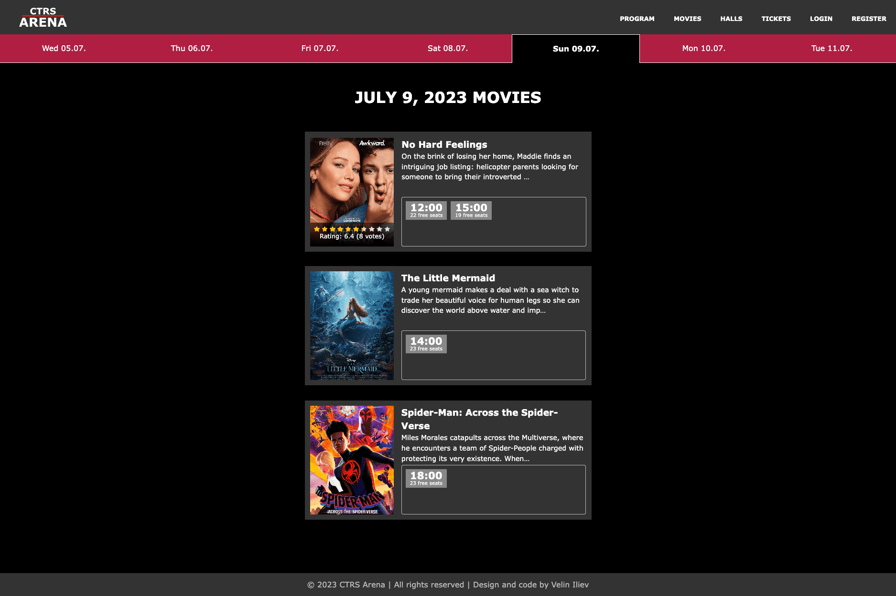
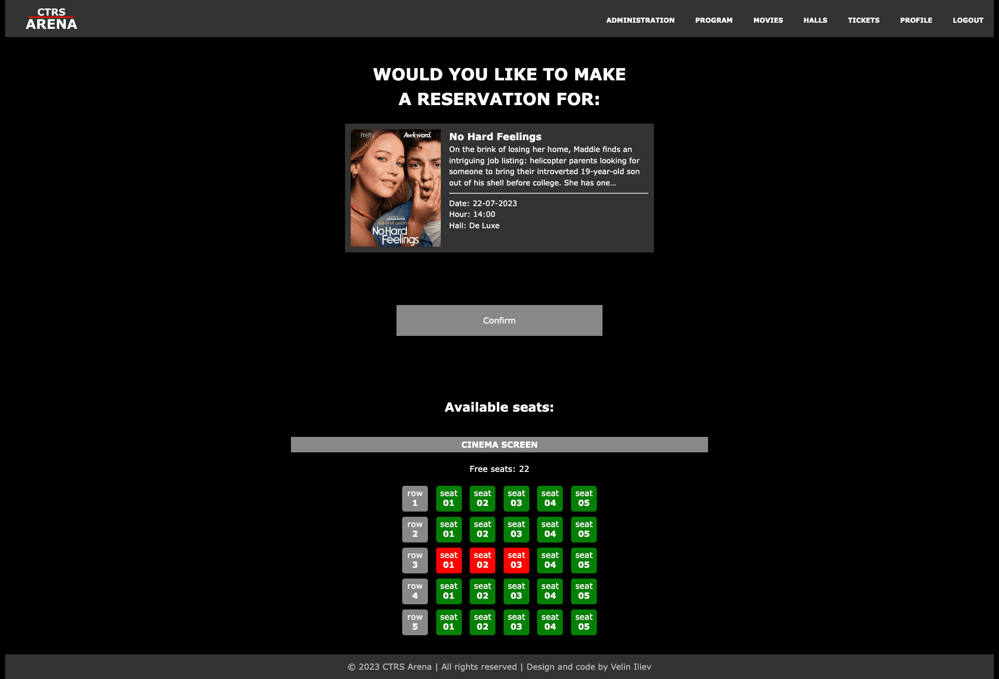
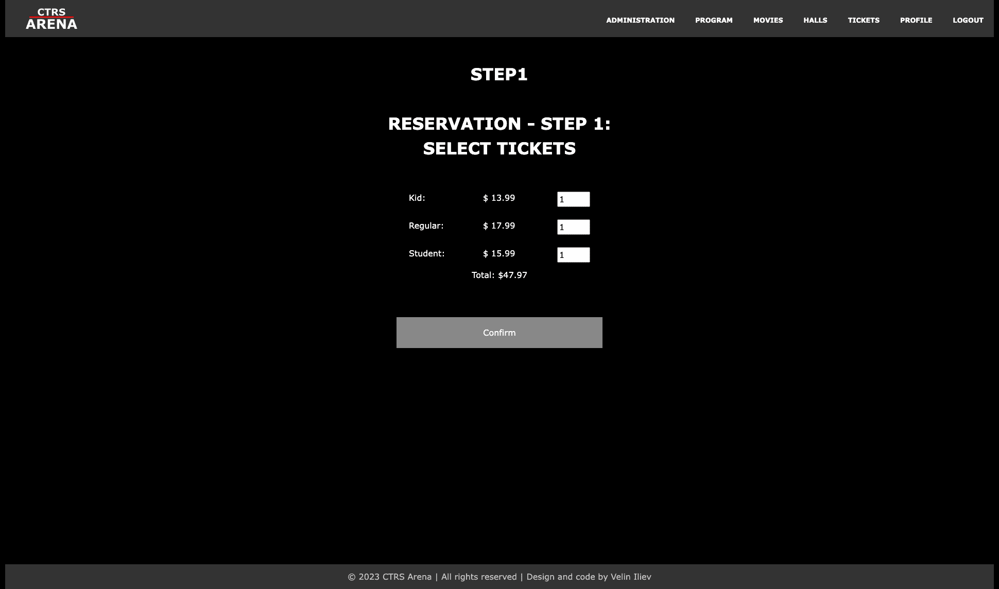
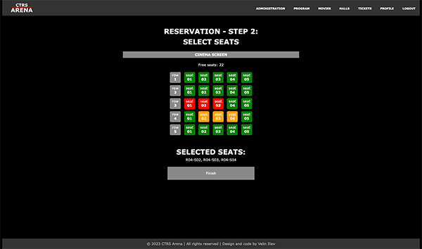

# Cinema Tickets Reservation System (CTRS)

---- final project for Python Web Framework - SoftUni ----

## <ins>Build with:<ins>
- Python
- Django
- PostgreSQL
- HTML
- Django template language
- CSS
- JavaScript
- Django Rest framework

## <ins>Description:</ins>
Automated movie ticket booking system. Easy to navigate and use.

## <ins>Paths:</ins>
  
- <b>/ - home page</b>
  

- <b>admin/</b>
    
Fully configured admin section with groups:

  - Admins: full control  
  - CinemaAdmin: CRUD to movies, halls, projections, tickets, can review users  
  - ContentCreator: Can create, edit, review movies and projections  
  - Moderators: CRUD of movie comments  
  - UserAdmin: CRUD of users  
  

- <b>profile/</b>
  - login/
  - logout/
  - register/
  - register/staff/ - only user with add_user permission can do it
  - details/<int:pk>/ - only the owner can see the complete information and the reservations he has made
  - delete/<int:pk>/ - only by the owner
  - edit/<int:pk>/ - only by the owner
- <b>movie/</b>
  - index - list of all movies sorted by most recently added, paginated by 8 
    
Search by title field. Option to order by rating.

    
On hover displays short info and rating

    

  - add/ - only users with this permission can add movie
  - details/<int:pk>/<str:slug>/ 
    
Full information about the movie.

    
Links to vote for movie and upcoming projections.

    
Comments section. Only logged users can comment.

    

  - edit/<int:pk>/<str:slug>/ - only users with this permission can edit movie
  - vote/<int:pk>/<str:slug>/ - only logged user can vote. User can only vote once per movie.
- <b>hall/</b>
  - index - list of all halls
  - add/ -  only users with this permission can add hall
  - details/<int:pk>/<str:slug>/ - Full information about the hall, with seating arrangement
  - edit/<int:pk>/<str:slug>/ - only users with this permission can edit hall
  - delete/<int:pk>/<str:slug>/ - only users with this permission can delete hall
- <b>projection/</b>
  - list of all projections for next 7 days, starting from today.
    
Ordered by movie and hour. Information about free seats for projection.

    

  - add/ only users with this permission can add projection
- <b>ticket/</b>
  - index - list of ticket types and prices
  - add/ - only users with this permission can add tickets
  - edit/<int:pk>/ - only users with this permission can edit tickets
  - delete/<int:pk>/ - only users with this permission delete add tickets
- <b>reservation/</b>
  - start/ - start reservation for selected movie, day, hour and hall. Information about free seats in the hall.
    
Only logged user can start reservation.

    

  - step1/
    
Selecting number and type of tickets

    

  - step2/ - selection of seats in the hall
    

  - review/<int:pk>/ - reservation overview 
- <b>api/</b> - Api integration for third party sites. Only GET requests.
  - movies/ - list of all movies
    - ?title= search by title
    - ?year= search by year
  - movies/<int:movie_id>/ - single movie view
  - projections/ - list of all projections
    - ?movie_id= projections for exact movie
    - ?movie_title= search for projections by movie title
    - ?start= search for projections after date 'dd-mm-yyyy'
    - ?end= search for projections before date 'dd-mm-yyyy'
    
Filters can be combined.
 
  - projections/<str:projection_date>/ - list of all projection on exact date: 'dd-mm-yyyy'

<ins>Administration links are visible only for staff users.</ins>
